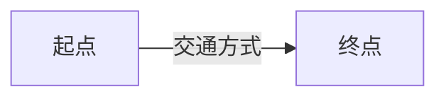

# Xiaohongshu Scraper Skill

抓取小红书（小红书 / RedNote / 小红薯 / XHS）的笔记、用户、搜索结果，输出可用于内容分析、飞书表格、个人备份的结构化数据。

---

## 何时调用此 Skill（When to Use）

当用户表达以下任一意图时调用：

| 用户原话模式 | 示例 |
|---|---|
| "爬/抓/采集小红书…" | "帮我爬一下博主 XXX 的笔记" |
| "想要 / 收集 / 备份小红书内容" | "我想把我喜欢的博主的所有笔记备份下来" |
| "导出小红书到飞书 / Excel / CSV" | "把这批笔记导成 CSV 我要导飞书" |
| "分析小红书某话题 / 关键词" | "搜索'露营'关键词下前 50 条笔记给我看" |
| "查某用户 / 看某笔记 / 拿某 ID" | "把这个 https://www.xiaohongshu.com/explore/xxx 的内容抓下来" |
| 提到 `note_id`、`user_id`、`xsec_token`、`a1`、`web_session` 等小红书技术词汇 | — |

**不要**用此 Skill 的场景：
- 抖音 / B 站 / 微博 / 知乎 等其他平台（除非用户明确切换到小红书）
- 自动发布 / 评论 / 点赞 / 关注 等账号操作（本 Skill 仅采集，不写）
- 任何用于商业用途的大规模采集（仅供个人学习研究）

---

## 工作流（Workflow）

### Step 0：环境自动准备（首次运行自动触发，无需手动操作）

**首次运行任何命令时，爬虫会自动检测并安装所有依赖**（Python 包、Node.js、crypto-js、Playwright Chromium）。整个过程约 2-5 分钟，取决于网络速度。

也可以手动触发完整安装和检查：

```bash
python scripts/xhs.py setup
```

**自动安装内容**：

| 组件 | 用途 | 安装方式 |
|---|---|---|
| Python 依赖 | requests, curl_cffi, PyExecJS, cryptography 等 | `pip install -r requirements.txt` |
| Node.js | 签名引擎 PyExecJS 需要 | winget / brew / apt（按平台自动选择） |
| crypto-js | 签名算法核心依赖 | `npm install`（在 assets/ 目录） |
| Playwright + Chromium | QR 登录 / 浏览器接管 / PlaywrightSigner | `playwright install chromium` |
| jieba | 图片/视频 本地文本分析（关键词提取） | `pip install -r requirements.txt`（含） |
| rapidocr-onnxruntime | 图片 OCR 文字识别 + 视频帧 OCR | `pip install -r requirements.txt`（含） |
| faster-whisper | 视频语音转文字 | `pip install -r requirements.txt`（含） |

安装完成后会自动验证所有包是否可导入，缺失的会列出提示。

**需要手动安装的组件**：

| 组件 | 用途 | 说明 |
|---|---|---|
| ffmpeg | 视频分析（语音提取+关键帧抽帧） | 系统级工具，需手动安装 |

```bash
# ffmpeg 安装
#   Windows: winget install Gyan.FFmpeg
#   macOS:   brew install ffmpeg
#   Linux:   sudo apt install ffmpeg
```

> 未安装 ffmpeg 时，视频分析会降级为仅 OCR，但 analyze-video 步骤仍需执行。

**配置图片/视频分析**（安装完依赖后运行）：

```bash
# 推荐：统一引导向导，一次性配置图片+视频
python scripts/xhs.py setup-wizard

# 单独配置视频分析
python scripts/xhs.py setup-video   # 视频分析
```

**手动安装（仅在自动安装失败时需要）**：

```bash
# Python 依赖
pip install -r requirements.txt

# Node.js（按平台选择）
#   Windows: winget install OpenJS.NodeJS
#   macOS:   brew install node
#   Linux:   sudo apt install nodejs

# crypto-js
cd assets && npm install && cd ..

# Playwright（QR 登录需要，不做 QR 可跳过）
playwright install chromium
# Linux/WSL 系统依赖:
sudo playwright install-deps chromium
```

**注意**：`rookiepy` 在 Python 3.13+ 暂无 wheel（需要 Rust 工具链编译），requirements.txt 已加 `python_version < "3.13"` 限定。若你是 Python 3.13+，登录请用 `--prefer manual` 或 `--prefer qr`。

### Step 1：签名健康检查（每次会话开始时强制）

```bash
# Windows 用 python，macOS/Linux 用 python3
python scripts/xhs.py sign-test
```

判断输出：
- 至少 `[embed-js] OK` 或 `[playwright] OK` 其一 → 继续
- `[py-port]` 永远 FAIL（有意未实现，是降级链终点）
- 两者都 FAIL → **JS 已过期**，转到「签名 JS 月度更新」节，不要继续抓
- 抓取过程中持续出现 460 → 同上

### Step 2：登录（cookie 不存在或失效时）

```bash
python scripts/xhs.py login                    # auto 模式：自动选择最优（rookiepy → 原生提取 → QR → 手动）
python scripts/xhs.py login --prefer rookie    # 从已登录的本地浏览器自动提取（推荐，跨平台）
python scripts/xhs.py login --prefer edge      # 从 Edge 浏览器提取 cookie（跨平台）
python scripts/xhs.py login --prefer chrome    # 从 Chrome 浏览器提取 cookie（跨平台）
python scripts/xhs.py login --prefer qr        # 弹 Chromium 让用户扫码（需 GUI）
python scripts/xhs.py login --prefer manual    # 让用户从 DevTools 粘贴 cookie 字符串
python scripts/xhs.py login --name <alias>     # 多账号：保存到 data/accounts/<alias>.json
```

`--prefer` 完整选项：
- `auto`（自动选择最优）
- `rookie`（rookiepy 跨平台提取）
- `edge`/`chrome`/`firefox`/`brave`（从对应浏览器提取 cookie）
- `native`/`native-edge`/`native-chrome`/`native-firefox`/`native-brave`（原生浏览器提取）
- `qr`（扫码）
- `manual`（手动粘贴）
- `wsl-edge`/`wsl-edge-cdp`/`wsl-chrome`/`wsl-chrome-cdp`（WSL 环境专用）

`data/cookies.json` 存在且包含 `web_session` 和 `a1` 即视为登录有效。Cookie 有效期约 30 天。

### 多账号授权

> 多号爬取能显著提升日抓上限（每个号 API 80/天 + DOM 搜索 100 页/天），且 460/461 风控时自动切换。

#### 方式一：QR 扫码（推荐，最简单）

不需要提前在浏览器登录任何账号，直接用手机扫码：

```bash
# 第一个号
python scripts/xhs.py login --prefer qr --name account1
# → 弹出浏览器窗口 → 打开手机小红书 App → 扫码 → 确认登录
# → 自动保存到 data/accounts/account1.json

# 第二个号
python scripts/xhs.py login --prefer qr --name account2
# → 再弹窗口 → 用另一个手机号的小红书 App 扫码
# → 保存到 data/accounts/account2.json

# 同一部手机也可以：在小红书 App 里切换账号后扫第二个码
```

每个 `--name` 用独立的浏览器 profile（`data/pw_profile_<name>`），互不干扰。

#### 方式二：从已登录的浏览器提取（适合已有登录态）

如果你已经在浏览器（Edge/Chrome/Firefox）登录了小红书，可以直接提取 cookie（无需关闭浏览器）：

**单账号**：
```bash
python scripts/xhs.py login              # 自动从浏览器提取，保存到 data/cookies.json
```

**多账号**（需要在浏览器中切换登录）：
```bash
# 1. 在 Edge 中登录小红书账号 A
python scripts/xhs.py login --name account1
# → rookiepy 秒级提取 cookie，保存完毕

# 2. 在 Edge 中退出账号 A，登录账号 B（或用无痕窗口登录 B）
python scripts/xhs.py login --name account2
# → 提取账号 B 的 cookie
```

> **关于浏览器 Profile**：Edge/Chrome 支持创建多个 Profile（独立登录态），但 rookiepy 默认只读默认 Profile 的 cookie。所以多账号最简单的做法是：**同一个 Profile 里换号登录，每次登录后运行一次 `login` 命令**。或者直接用 QR 扫码，完全不需要关心浏览器。

**指定浏览器提取**：
```bash
python scripts/xhs.py login --prefer edge --name edge_account     # 从 Edge 提取
python scripts/xhs.py login --prefer chrome --name chrome_account # 从 Chrome 提取
```

#### 方式三：两个不同浏览器各登录一个号

如果 Edge 登录了账号 A，Chrome 登录了账号 B：
```bash
python scripts/xhs.py login --prefer edge --name account1
python scripts/xhs.py login --prefer chrome --name account2
```

#### 方式四：手动粘贴（任何环境都可用）

不需要任何依赖，适合服务器等无 GUI 环境：
```bash
python scripts/xhs.py login --prefer manual --name account1
# → 提示粘贴 cookie → 在浏览器登录小红书 → F12 → Application → Cookies → 复制全部

python scripts/xhs.py login --prefer manual --name account2
# → 切换浏览器账号或用无痕窗口 → 重复上述步骤
```

#### 验证账号

```bash
python scripts/xhs.py accounts
# 输出:
#   [account1       ] 日抓   0/80  累计     0  460×0  461×0
#   [account2       ] 日抓   0/80  累计     0  460×0  461×0
```

**自动轮换行为**：运行任何爬取命令时，系统自动选择最久未用的可用账号。触发 460/461 风控时自动冷却当前号并切换到下一个。不需要手动指定账号。

### Step 3：抓取（按用户意图分流）

| 用户意图 | 命令 | 说明 |
|---|---|---|
| 抓单条笔记 | `python scripts/xhs.py note <note_id> [--xsec-token <token>]` | 缺 xsec_token 时自动搜索降级获取；DB 里有 token 时自动复用；获取不到则拒绝执行避免 461 |
| 抓某用户笔记列表 | `python scripts/xhs.py user <user_id> --pages 3 --download --analyze` | 前 N 页，每页 30 条；加 `--download --analyze` 自动下载+分析 |
| 抓关键词搜索 | `python scripts/xhs.py search "<关键词>" --pages 2 --download --analyze` | 前 N 页，每页 20 条；加 `--download --analyze` 自动下载+分析 |

> **搜索模式说明**：搜索默认使用真实浏览器 DOM 模式，通过浏览器渲染页面提取搜索结果，避免 API 指纹暴露。用户主页和笔记详情仍通过 API 获取（受签名保护），不走 DOM。
> 
> 可通过环境变量控制搜索行为：
> - `XHS_SEARCH_MODE=dom`（默认）— 浏览器 DOM 搜索；`=api` 切换为 API 搜索（需签名，小时配额限制）
> - `XHS_SEARCH_HOURLY_QUOTA=3`（默认）— API 搜索模式的小时配额上限
> - 也可在 `data/config.json` 中设置 `search_mode` 键
| 补全半成品笔记 | `python scripts/xhs.py enrich --limit 50` | 搜索入库但无标题/详情的笔记，逐条调详情 API 补全（需要 xsec_token） |
| 抓某笔记评论 | `python scripts/xhs.py comments <note_id> --max-pages 5 --max-sub-pages 3 [--no-sub]` | 含子评论分页；`--no-sub` 跳过子评论分页 |
| 下载某笔记图片/视频 | `python scripts/xhs.py download <note_id> [--no-video] [--overwrite]` | `--no-video` 不下载视频；`--overwrite` 重新下载已有文件 |
| 推荐流/分类流 | `python scripts/xhs.py feed --category <cat> --pages 2 [--num 18]` | 分类见下方；`--num` 每页条数 |
| **长任务** 关键词 + 断点续抓 | `python scripts/xhs.py crawl-search "<kw>" --max-pages 20 [--resume]` | 风控/中断后 `--resume` 接续 |
| **长任务** 用户全部笔记 | `python scripts/xhs.py crawl-user <user_id> --max-pages 50 [--resume]` | 同上 |
| 视频内容智能分析 | `python scripts/xhs.py analyze-video <note_id>` | 语音转文字 + 关键帧 OCR（转录需 Agent 纠错，见 `correct` 命令） |
| Agent 转录纠错 | `python scripts/xhs.py correct --list` | 列出待纠错视频笔记；`--note <id> --apply "<文本>"` 写回纠错后转录 |
| 配置视频分析 | `python scripts/xhs.py setup-video` | 交互配置 Whisper 模型、帧间隔、可选 LLM 纠错后端 |

> **单篇笔记完整处理**：抓取单条笔记时，必须依次执行 note → download → comments → analyze-images/analyze-video → export。详见「单篇笔记完整处理流程（强制标准）」节。

**feed --category 可选值**：`recommend`（推荐，默认）、`food`（美食）、`fashion`（穿搭）、`travel`（旅行）、`beauty`（美妆）、`fitness`（健身）。

**通用参数**（默认值是最稳的，**首次或风控强时强烈建议加** `--speed-mode paranoid`）：

```
--sign-mode {auto, embed-js, playwright, py-port}   # 默认 auto，自动选最优并降级
--speed-mode {paranoid}                              # 当前仅 paranoid（每请求 4-10 分钟，最安全）
--proxy http://host:port                            # 走代理
--account <alias>                                   # 多账号时指定账号别名
```

### Step 4：内容智能分析（每条笔记必须执行）

**所有笔记都必须经过分析步骤**，这是输出质量的核心保证，不是可选环节。

| 笔记类型 | 必须执行的分析命令 | 说明 |
|---|---|---|
| 图文笔记 | `analyze-images` | OCR 文字提取 + AI 视觉描述 |
| 视频笔记 | `analyze-video` + **`correct`** | 语音转文字 + 关键帧 OCR，转录用 `correct` 子命令纠错 |

```bash
# 图文笔记
python scripts/xhs.py analyze-images <note_id>

# 视频笔记
python scripts/xhs.py analyze-video <note_id>
```

> **批量模式（推荐）**：使用 `user` / `search` / `crawl-*` 命令时加 `--download --analyze`，在同一个进程内自动完成下载+分析，避免数据库锁冲突：
> ```bash
> python scripts/xhs.py user <user_id> --pages 3 --download --analyze
> python scripts/xhs.py search "关键词" --pages 2 --download --analyze
> python scripts/xhs.py crawl-user <user_id> --max-pages 20
> python scripts/xhs.py crawl-search "关键词" --max-pages 5
> ```
>
> **注意**：以上命令含视频分析时，单条视频需要 30-120 秒。执行时请设置充足 timeout（建议 600 秒以上），或使用 crawl 命令让 skill 内部调度。
>
> ⚠️ **串行执行原则**：所有命令共享同一个 SQLite 数据库，不支持同时运行。等上一个命令完全结束后再启动下一个。如果命令超时，skill 会自动检测并清理残留锁，无需手动干预。

> **分析依赖**（未安装时自动降级为仅 OCR）：ffmpeg（视频音频提取）、faster-whisper（语音转文字）、rapidocr-onnxruntime（OCR）。即便依赖不完整，analyze 步骤也必须执行——至少会产出 OCR 结果。

### Step 5：导出（按用户需要的格式）

```bash
python scripts/xhs.py export --note <note_id> --format md    # 单篇 Markdown（多文件目录）
python scripts/xhs.py export --format csv                    # 全量 CSV（按博主分文件）
python scripts/xhs.py export --format csv --user <user_id>   # 指定博主的 CSV
python scripts/xhs.py export --format json                   # 全量 JSON
python scripts/xhs.py export --format json --user <user_id>  # 指定博主的 JSON
python scripts/xhs.py export --format xlsx                   # 全量 XLSX（多 sheet，需 openpyxl）
```

输出位置：`data/output/`（Markdown 按博主分子目录，CSV 按博主分文件）

### 自动机制（无需手动操作）

以下机制在抓取流程中自动执行，无需用户干预：

**自动 PG 同步**：数据写入类命令（note/user/search/crawl-*/enrich 等）成功退出后，自动将 SQLite 数据同步到 PostgreSQL（`.env` 中 `POSTGRES_DB` 配置的库）。PG 不可用时静默跳过，不影响主流程。

**纠错提醒**：视频笔记入库后，命令退出前自动检测待纠错转录并打印 `⚠️ [CORRECT] 待纠错 N 条`，提示用 `correct --list` / `correct --note <id> --apply` 处理。看到该提示即应执行纠错，否则转录含同音字错误不可用。

**raw_json 保护**：同一条笔记被多次入库时（如先搜索后抓详情），系统自动保留更完整的 `raw_json`（按长度比较），防止搜索摘要覆盖详情数据。

**461 重试上限**：遇到 461 验证码时最多重试 3 次（`_retry_depth >= 3`），超限直接终止并报错，避免无限循环。

**xsec_token 自动获取**：`note` 命令在缺少 xsec_token 时，会自动通过搜索 API 查找该笔记获取 token；获取不到则拒绝执行（返回退出码 1），避免无 token 直接触发 461 风控。

### Step 6：逐条报告（重要原则）

**禁止**："先把 100 条全部抓完，最后统一报告"。
**正确**：每抓完一条立刻在终端打印一行（命令自带），完整入库后再抓下一条。这样用户随时可中断且已完成的数据已落盘。

---

## 子命令速查表

| 命令 | 用途 | 需要登录 |
|---|---|---|
| `setup` | 安装所有依赖（首次运行自动触发，此命令用于排查） | 否 |
| `sign-test` | 三档签名健康检查 | 否 |
| `login [--prefer <mode>] [--name <alias>]` | 获取并落库 cookie（`--name` 保存到 data/accounts/） | 否 |
| `note <id>` | 单笔记详情入库 + MD 输出 | 是 |
| `user <id> --pages N [--download] [--analyze]` | 用户信息 + 笔记列表前 N 页入库 | 是 |
| `search <kw> --pages N [--download] [--analyze]` | 关键词搜索前 N 页入库 | 是 |
| `comments <id> [--max-pages N] [--max-sub-pages N] [--no-sub]` | 评论树（含子评论分页，`--no-sub` 跳过子评论） | 是 |
| `download <id> [--no-video] [--overwrite]` | 图片/视频本地化 | 否 |
| `feed --category <cat> --pages N [--num N]` | 推荐流/分类流浏览入库 | 是 |
| `crawl-search <kw> --max-pages N [--resume] [--no-download] [--no-analyze]` | 关键词断点续抓（默认下载+分析） | 是 |
| `crawl-user <id> --max-pages N [--resume] [--no-download] [--no-analyze]` | 用户全部笔记断点续抓（默认下载+分析） | 是 |
| `crawl-feed --category <cat> --max-pages N [--resume] [--no-download] [--no-analyze]` | 推荐流断点续抓（默认下载+分析） | 是 |
| `analyze-video <id> [--correct-mode <mode>] [--whisper-model <m>] [--frame-interval N] [--max-duration N] [--step extract transcribe ocr]` | 视频内容智能分析（转录+OCR；转录需随后用 `correct` 子命令纠错；单条约 2-5 分钟，timeout 需 >=300s；`--max-duration` 限制分析时长，默认 300s） | 否 |
| `correct --list [--limit N]` / `--note <id>` / `--note <id> --apply "<文本>"` | Agent 手动纠错视频转录：列出/读取/写回（标记 `video_summary='agent纠错'`，OCR 原样保留） | 是 |
| `setup-video [--correct-mode <mode>] [--whisper-model <m>] [--frame-interval N]` | 交互式配置视频分析 | 否 |
| `analyze-images <id>` | 图片内容智能分析（OCR+AI视觉+Mermaid图表） | 否 |
| `setup-wizard` | 统一引导向导：配置图片+视频分析（推荐首次运行） | 否 |
| `export --format md --note <id>` | 单篇 MD（多文件目录：index.md + video.md + images.md + comments.md） | 否 |
| `export --format csv [--user <id>]` | CSV（按博主分文件，`--user` 过滤指定博主） | 否 |
| `export --format json [--user <id>]` | JSON（`--user` 过滤指定博主） | 否 |
| `export --format xlsx [--user <id>]` | XLSX（多 sheet: notes/users/comments，`--user` 过滤指定博主，需 openpyxl） | 否 |
| `accounts` | 多账号状态查看 | 否 |
| `stats [--hours N] [--account <alias>]` | 请求统计（`--account` 按账号过滤） | 否 |
| `refresh-cookies [--force]` | 批量检查并刷新所有账号 cookie | 否 |
| `keepalive [--daemon] [--force] [--account <alias>] [--interval N]` | Cookie 保活（单次或守护进程模式；`--interval` 秒，默认 7200） | 否 |
| `update-js [--dry-run]` | 从 Spider_XHS 拉取最新签名 JS | 否 |
| `analyze --type {sentiment\|topics} [--keyword <kw>] [--user <id>] [--note <id>] [--output json]` | 评论情感分析 / 话题聚类（`--output json` 输出 JSON） | 否 |
| `health` | 系统健康检查（依赖+签名+账号+DB），返回码 0=健康 1=降级 2=严重 | 否 |
| `refresh --max-age-hours N --limit N` | 重抓超过 N 小时的旧笔记（增量更新） | 是 |
| `enrich --limit N` | 补全搜索入库的半成品笔记（无标题/详情的笔记逐条调详情 API） | 是 |
| `cleanup [--dry-run] [--max-cache-days N] [--max-state-days N] [--vacuum]` | 数据清理：孤儿媒体、过期缓存、VACUUM 压缩 | 否 |
| `update-fp [--dry-run]` | 全量更新 UA/指纹池/TLS/签名 JS | 否 |
| `run --keywords <kw> [--max-notes N] [--pages N]` | 按需执行模式：单次搜索+提取，用完即停（比 serve 更安全） | 是 |
| `serve --targets <t1> <t2> [--interval N] [--max-pages N] [--proxy URL]` | 守护进程模式：自动循环爬取（`--interval` 小时，`--targets` 格式 `search:kw`/`user:uid`/`feed`） | 是 |

---

## 用户请求 → 命令映射示例

> **用户**："帮我抓一下这条小红书 https://www.xiaohongshu.com/explore/6603abc123?xsec_token=xxx"

```bash
# 完整单篇处理流程（必须执行所有步骤）
python scripts/xhs.py note 6603abc123 --xsec-token xxx --speed-mode paranoid
python scripts/xhs.py download 6603abc123
python scripts/xhs.py comments 6603abc123
python scripts/xhs.py analyze-images 6603abc123
# [MCP 后端时] AI Agent 用 MCP 视觉工具逐张分析图片 → 写入 DB → 重新渲染
python scripts/xhs.py export --format md --note 6603abc123
```

> **用户**："我想备份博主 5fa8xxx 的所有笔记，导成 csv 给飞书用"

```bash
python scripts/xhs.py user 5fa8xxx --pages 50 --speed-mode paranoid --download --analyze
python scripts/xhs.py export --format csv --user 5fa8xxx
```

> **用户**："搜'露营装备'前 3 页"

```bash
python scripts/xhs.py search "露营装备" --pages 3 --download --analyze
python scripts/xhs.py export --format csv
```

> **用户**："抓不动了一直 460"

→ 切到 paranoid 并降级签名：
```bash
python scripts/xhs.py sign-test  # 先确认签名档可用性
python scripts/xhs.py user <id> --speed-mode paranoid --sign-mode playwright --download --analyze
```

仍不行 → 跳到「签名 JS 月度更新」节。

> **用户**："看看推荐流有什么好内容"

```bash
python scripts/xhs.py feed --category recommend --pages 2
# feed 不支持 --analyze，需要对单条笔记执行分析
# 或使用 crawl-feed --download --analyze 自动分析
python scripts/xhs.py export --format csv
```

> **用户**："之前搜索入库的笔记标题都是空的，能补全吗？"

```bash
# 自动找到标题为空或数据不完整的笔记，逐条调详情 API 补全
python scripts/xhs.py enrich --limit 50
```

> **用户**："分析一下'露营'关键词下的评论情感"

```bash
python scripts/xhs.py search "露营" --pages 3 --download --analyze
python scripts/xhs.py analyze --type sentiment --keyword "露营"
```

> **用户**："看看这个博主发的内容都有什么话题"

```bash
python scripts/xhs.py user <user_id> --pages 10 --download --analyze
python scripts/xhs.py analyze --type topics --user <user_id>
```

> **用户**："签名 JS 过期了" / "sign-test 全 FAIL"

```bash
python scripts/xhs.py update-js
python scripts/xhs.py sign-test   # 验证
```

> **用户**："帮我检查一下所有账号的 cookie 还有没有效"

```bash
python scripts/xhs.py refresh-cookies
```

---

## 视频内容智能分析

小红书大量博主以视频形式发布内容，视频分析功能对已入库的视频笔记做深度内容提取：

### 流程

```
1. extract     → ffmpeg 提取音频(wav) + 关键帧(frames/*.jpg)
2. transcribe  → faster-whisper 语音转文字
3. OCR         → rapidocr 逐帧画面文字识别
4. Agent 纠错  → AI Agent 用 OCR 画面文字纠正 Whisper 转录中的同音字和英文错误
```

最终输出是**纠错后的转录文本**（而非原始 Whisper 输出）。Agent 纠错使用 OCR 画面文字作为参照，修正同音字（如"设训品→奢侈品"、"协率→斜率"、"老犯→老范"）和英文识别错误（如"Cloud→Claude"、"P2T→Peter Thiel"）。

### 依赖（未安装时自动降级为仅 OCR，但分析步骤必须执行）

| 依赖 | 用途 | 安装 |
|---|---|---|
| ffmpeg | 音频提取 + 关键帧抽帧 | `winget install Gyan.FFmpeg` / `brew install ffmpeg` / `sudo apt install ffmpeg` |
| faster-whisper | 语音转文字（本地，支持中文） | `pip install faster-whisper`（含在 requirements.txt） |
| rapidocr-onnxruntime | 画面文字 OCR（纯 Python，CPU 可跑） | `pip install rapidocr-onnxruntime`（含在 requirements.txt） |

### 配置

```bash
# 交互式配置（推荐首次使用时运行）
python scripts/xhs.py setup-video

# 或直接指定参数
python scripts/xhs.py setup-video --whisper-model base --frame-interval 5
```

配置文件：`data/video_config.json`（Whisper 模型、帧间隔等参数，纠错由 Agent 完成无需配置 API）

### Agent 转录纠错（必须执行）

Whisper 语音转文字存在大量同音字和英文识别错误，**所有视频笔记的转录都必须由 Agent 纠错后才能阅读**。不需要配置外部 API，直接由当前 Agent 完成。

**纠错流程**：

1. Python 完成 Whisper 转录 + OCR，写入 DB
2. Agent 从 DB 读取转录 + OCR 参照文字
3. Agent 纠正同音字、英文错误、专有名词错误
4. Agent 将纠错后的转录写回 DB（`video_summary='agent纠错'`）

**纠错命令**（封装为 `correct` 子命令，Agent 必须用命令、不得手拼 SQL）：

```bash
# 1. 列出待纠错视频笔记（每条含完整 transcript + OCR 参照）
python scripts/xhs.py correct --list --limit 50

# 2. 读单条（可选；--list 已含全文）
python scripts/xhs.py correct --note <note_id>

# 3. Agent 纠错后写回（video_transcript=纠错文本，标记 video_summary='agent纠错'；OCR 原样保留不被覆盖）
python scripts/xhs.py correct --note <note_id> --apply "纠错后的完整转录文本"
```

`--list` 已输出每条的完整转录 + OCR，Agent 读后逐条纠错、用 `--apply` 写回。`--apply` 经 subprocess 传参，长文本/特殊字符安全。

**典型纠错对照表**：

| Whisper 错误 | 正确 | 类型 |
|---|---|---|
| 设训品 | 奢侈品 | 同音字 |
| 协率/协力 | 斜率 | 同音字 |
| 老犯 | 老范 | 同音字 |
| 长火 | 长虹 | 同音字 |
| 空桥 | 空调 | 同音字 |
| 神堂山 | 神坛上 | 同音字 |
| Cloud | Claude | 英文 |
| P2T | Peter Thiel | 英文 |
| 归谷 | 硅谷 | 同音字 |
| 科学 | Cursor | 上下文 |

### 使用

```bash
# 1. 先抓取并下载视频
python scripts/xhs.py note <video_note_id>
python scripts/xhs.py download <video_note_id>

# 2. 分析视频内容（Python 完成转录+OCR）
python scripts/xhs.py analyze-video <video_note_id>

# 3. Agent 纠错转录（必须执行，否则文字无法阅读）
#    读取 DB 中的转录 → 纠正同音字和英文错误 → 写回 DB
#    详见「Agent 转录纠错」章节
```

### 视频分析耗时预期（重要）

默认配置针对 **2-5 分钟内的稳定分析** 优化：
- **Whisper 模型**: 默认 `base`（加载 ~10s，精度与速度平衡），追求速度可改为 `tiny`（快 5 倍但精度低）
- **最长转录**: 默认只转录前 300 秒（5 分钟）音频，长视频自动截断
- **Agent 纠错**: 在后续步骤由 Agent 读取 DB 中的转录并纠错（不占用 analyze-video 命令时间）
- **典型耗时**: 短视频 60-90s，中等视频 90-180s（不含 Agent 纠错）

> **执行要求**：运行 `analyze-video` 时，终端 timeout 设置 **300 秒（5分钟）** 以覆盖绝大多数视频。长视频（>10分钟）如需完整转录，用 `--max-duration 0` 并设置更长 timeout。含 `--download` 的批量命令 timeout 建议 600 秒。

```bash
# 默认：base 模型 + 前 5 分钟音频（推荐，90-180s 完成）
python scripts/xhs.py analyze-video <note_id>

# 追求速度（精度略降，耗时减半）
python scripts/xhs.py analyze-video <note_id> --whisper-model tiny

# 长视频完整转录（可能需要 5-10 分钟）
python scripts/xhs.py analyze-video <note_id> --max-duration 0
```

**推荐方式一：crawl 命令（不受终端 timeout 限制）**

crawl 命令在单进程内完成所有操作，agent 只需等待最终结果：

```bash
# 推荐：crawl 命令默认下载+分析，内部调度不受 timeout 干扰
python scripts/xhs.py crawl-user <user_id> --max-pages 2
python scripts/xhs.py crawl-search "关键词" --max-pages 3
```

**推荐方式二：单独 analyze-video + 充足 timeout**

```bash
# agent 应设置 timeout >= 300s
python scripts/xhs.py analyze-video <note_id>
```

**方式三：--step 分段执行（仅当 timeout 无法调整时）**

```bash
# 第1步：提取音频+关键帧（约 10-20s）
python scripts/xhs.py analyze-video <note_id> --step extract

# 第2步：语音转录（约 30-120s，设置 timeout>=300s）
python scripts/xhs.py analyze-video <note_id> --step transcribe

# 第3步：OCR + 纠错（约 10-20s）
python scripts/xhs.py analyze-video <note_id> --step ocr
```

中间结果缓存在视频目录的 `_cache/` 下，超时后下次调用自动复用。

### 长任务自动分析

crawl 命令**默认开启下载+分析**（`--download` 和 `--analyze` 默认为 True）。如需跳过可用 `--no-download` / `--no-analyze`。

```bash
# 默认行为：自动下载 + 自动分析
python scripts/xhs.py crawl-search "美食" --max-pages 5

# 跳过分析，仅入库+下载
python scripts/xhs.py crawl-user <user_id> --max-pages 20 --no-analyze
```

### 输出

分析结果存入 DB（`video_transcript` / `video_ocr_text` 字段），自动反映到 CSV 导出和 Markdown 渲染中。

---

## 图片内容智能分析

小红书大量关键信息以图片形式呈现（路线图、步骤流程、穿搭分解、参数表格等）。图片分析功能可对已入库的图文笔记做深度内容提取：

### 三层分析能力

| 层级 | 功能 | 说明 |
|---|---|---|
| Layer 1: OCR | 文字提取 | rapidocr 识别图片中所有文字 |
| Layer 2: AI 视觉 | 内容描述 | AI "看懂"图片（路线、穿搭、步骤...） |
| Layer 3: Mermaid | 图表生成 | 自动生成路线图/流程图（嵌入 MD） |

### 依赖（未安装时自动降级为仅 OCR，但分析步骤必须执行）

| 依赖 | 用途 | 安装 |
|---|---|---|
| rapidocr-onnxruntime | 图片文字 OCR | `pip install rapidocr-onnxruntime`（含在 requirements.txt） |
| jieba | 本地模式文本分析 | `pip install jieba`（含在 requirements.txt） |

### 配置

```bash
# 推荐：统一引导向导，一次性配置图片+视频
python scripts/xhs.py setup-wizard
```

配置文件：`data/image_config.json`

三维度独立配置：

| 维度 | 选项 | 说明 |
|---|---|---|
| `image_mode` | `auto` / `none` / `local` / `vision` | 自动判断 → 仅 OCR → 本地分析 → AI 视觉（默认 auto） |
| `image_vision_backend` | `ollama` / `api` / `mcp` | 仅 vision 模式 |
| `image_mermaid` | `true` / `false` | 是否生成路线图/流程图 |

视觉后端支持任意 OpenAI 兼容服务商（智谱 GLM-4V / 通义 Qwen-VL / 硅基流动 / DeepSeek / GPT-4o 等）。

MCP 视觉后端（`mcp`）由 AI Agent 运行时提供，支持 Claude Code / GLM Coding / Cursor / Windsurf / Cline 等所有 MCP 客户端。无需额外配置，Python 输出任务清单，Agent 调用自己环境中的 MCP 视觉工具完成分析。

### 使用

```bash
# 1. 先抓取并下载图片
python scripts/xhs.py note <note_id>
python scripts/xhs.py download <note_id>

# 2. 分析图片内容
python scripts/xhs.py analyze-images <note_id>

# 图片分析模式通过 setup-wizard 或 data/image_config.json 配置
# 可选模式：auto / none / local / vision
```

### 长任务自动分析

crawl 命令的 `--analyze` 标志已扩展支持图文笔记：

```bash
# 搜索 + 自动下载 + 自动图片分析
python scripts/xhs.py crawl-search "露营" --max-pages 5 --download --analyze
```

### 输出

分析结果存入 DB（`image_ocr_text` / `image_summary` / `image_mermaid` 字段），自动反映到 CSV 导出和 Markdown 渲染中。

### MCP 视觉分析工作流

当 `image_vision_backend` 为 `"mcp"` 时，Python 脚本输出结构化任务清单，AI Agent 使用当前环境中可用的 MCP 视觉工具完成分析。适配所有 MCP 客户端（Claude Code / GLM Coding / Cursor / Windsurf / Cline）。

**第一步：运行分析命令**
```bash
python scripts/xhs.py analyze-images <note_id>
```

**第二步：解析 `[MCP_VISION_TASK]` 输出**

脚本在 stderr 输出任务清单：
```
[MCP_VISION_TASK]
title: 笔记标题
image_count: 5
images:
  - data/media/博主名/笔记标题/img_01.jpg
  - data/media/博主名/笔记标题/img_02.jpg
  ...
ocr_text: |
  [img_01] 已有的 OCR 文字...
prompt: |
  请分析这篇小红书笔记的图片...
[/MCP_VISION_TASK]
```

**第三步：使用 MCP 工具分析图片**

根据当前环境可用的 MCP 视觉工具调用分析：
- 有 `analyze_image` → 用 analyze_image 逐张或分批分析
- 有 `locate_objects` → 可用于目标检测类场景
- 有 `compare_images` → 可分批比较后综合

图片传递方式（根据 MCP Server 支持的输入类型选择）：
- 支持 URL → 先用 Read 工具读取图片（自动上传 CDN），传 CDN URL
- 支持文件路径 → 直接传本地图片路径
- 支持 base64 → 将图片 base64 编码后传入

**第四步：综合所有图片分析结果**

汇总各图片分析结果，生成笔记整体视觉描述（200-500 字中文）。

**第五步：写入 DB**
```bash
python -c "
import sys; sys.path.insert(0, 'scripts')
import xhs_storage, sqlite3
conn = sqlite3.connect('data/xhs.db')
xhs_storage.update_image_analysis(conn, '<note_id>', '<ocr_text>', '<vision_summary>', '')
conn.close()
"
```

**第六步：重新渲染 MD**
```bash
python scripts/xhs.py export --note <note_id> --format md
```

**各 MCP Server 适配指南**

| MCP Server | 后端模型 | 接受输入 | 关键工具 |
|---|---|---|---|
| ai-vision-mcp | Google Gemini / Vertex AI | URL + 文件路径 + base64 | `analyze_image`, `analyze_video` |
| groundlight/mcp-vision | HuggingFace CV | URL + 文件路径 | `locate_objects`, `zoom_to_object` |
| Z.AI Vision MCP | 内置 | 远程 URL | `analyze_image` |
| AI Image MCP | OpenAI Vision | URL + base64 | `analyze_image` |
| OpenRouter Image MCP | OpenRouter | URL | `analyze_image` |

MCP 协议标准：JSON-RPC（`tools/list` 发现 → `tools/call` 调用），stdio/HTTP 双传输。

---

## 错误处理与故障排查

| 现象 | 原因 | 处理 |
|---|---|---|
| `sign-test` 全 FAIL | JS 文件过期或缺失 / 没装 Node + crypto-js | 1) 先确认 `cd assets && npm install crypto-js`；2) 若仍失败运行 `update-js` |
| `login` 报 `BrowserNotFound` 或 rookiepy 装不上 | Python 3.13+ 或本地浏览器未登录 | 改 `--prefer qr` 或 `--prefer manual` |
| 搜索返回 -104 | 搜索 API 风控（阿瑞斯最严格入口） | **自动降级到 DOM 搜索**（真实浏览器），无需干预 |
| 非 API 返回 -104 | b1 令牌过期 | 自动刷新 b1 缓存重试一次，失败再 DOM 降级（搜索）或 FatalRiskError |
| `[FETCH] 460 风控 ×3` 连续触发 | 短时请求太多 | 自动降速 + 切账号 + 切代理 |
| `[FETCH] success=False code=-100` | cookie 过期 | 自动重新登录并重试 |
| `[FATAL] 达到单账号日抓硬上限 80` | 当日 API 请求量超出 | 等明天，或添加更多账号 |
| `[FATAL] 风控强度超出处理能力` | 所有防线失效 | 等 24h；考虑换 IP；最坏情况换账号 |
| Playwright 在 WSL/Linux 启动失败 | 缺系统库 | `sudo apt install libnss3 libnspr4 libatk1.0-0 libatk-bridge2.0-0 libcups2 libdrm2 libxkbcommon0 libxcomposite1 libxdamage1 libxfixes3 libxrandr2 libgbm1 libpango-1.0-0 libcairo2 libasound2` |
| `py_mini_racer` 装不上（ARM Mac 等） | wheel 不匹配 | `pip install PyExecJS` + 安装 Node.js（代码会自动 fallback） |

---

## 签名 JS 月度更新（关键运维）

小红书签名 JS 约**每月轮换一次**。判断信号：
1. `sign-test` 三档全 FAIL
2. 抓取大量 460 即使切到 paranoid
3. 上次更新 JS 已超过 30 天

**方式一：自动更新（推荐）**

```bash
python scripts/xhs.py update-js
```

**方式二：手动更新**

```bash
# 1. 拉最新签名 JS（cv-cat/Spider_XHS 月度维护）
git clone --depth 1 https://github.com/cv-cat/Spider_XHS.git /tmp/xhs_ref_latest

# 2. 覆盖到 assets/（mtime 变化后下一次 sign 自动 reload，无需重启）
#    找到日期最新的 xhs_main_*.js
cp /tmp/xhs_ref_latest/static/xhs_main_<日期>.js  assets/xhs_main.js
cp /tmp/xhs_ref_latest/static/xhs_rap.js           assets/

# 3. 验证
python scripts/xhs.py sign-test
```

---

## 单篇笔记完整处理流程（强制标准）

> **重要**：所有笔记必须按以下完整流程处理，确保输出格式统一。每篇笔记的 Markdown 输出必须包含以下五个部分：正文、图片（本地路径）、图片分析（AI 描述 + OCR）、评论。

### 必须执行的步骤（按顺序）

```
步骤 1: 抓取笔记详情
  python scripts/xhs.py note <note_id>

步骤 2: 下载图片/视频到本地
  python scripts/xhs.py download <note_id>

步骤 3: 抓取评论
  python scripts/xhs.py comments <note_id>

步骤 4: 内容智能分析（必须执行，根据类型分流）
  # 图文笔记：
  python scripts/xhs.py analyze-images <note_id>
  # 视频笔记：
  python scripts/xhs.py analyze-video <note_id>

步骤 5: ⚠️ Agent 纠错/分析（必须执行，不可省略）
  → 图文：[MCP 后端时] AI Agent 用 MCP 视觉工具逐张分析图片 → 综合描述 → 写入 DB
  → 视频：`correct --list` 读待纠错转录 + OCR → Agent 纠正同音字/英文错误 → `correct --note <id> --apply "<纠错后>"` 写回
  → 提示：数据写入命令退出时会自动打印 `⚠️ [CORRECT] 待纠错 N 条`，看到即用 correct 处理，**不要留到"下一步"**。

步骤 6: 重新导出 Markdown（最终渲染，包含所有内容）
  python scripts/xhs.py export --note <note_id> --format md
```

**不允许省略任何步骤。** 步骤 4 是必须执行的——即便依赖不完整，至少会产出 OCR 结果。如果某步骤失败，应排查重试，而非跳过。

### 输出 Markdown 必须包含的结构

每篇笔记导出为**多文件目录**：`output/<博主名>/<标题>_<note_id前8位>/`

| 文件 | 内容 | 生成条件 |
|------|------|----------|
| `index.md` | 元数据 + 正文 + 图片 + 视频基本信息 + 子文件链接 | 必有 |
| `video.md` | 视频摘要 + 语音转录 + 画面文字 | 有视频分析结果时 |
| `images.md` | AI 描述 + 图片 OCR + Mermaid 图表 | 有图片分析结果时 |
| `comments.md` | 全部主评论 + 子评论 | 有评论时 |

#### index.md 结构

```markdown
# 笔记标题

- **作者**: 昵称 (@user_id)
- **发布时间**: YYYY-MM-DD HH:MM:SS
- **IP属地**: xxx
- **互动**: 赞 N | 藏 N | 评 N | 分享 N
- **话题**: #tag1 #tag2
- **类型**: normal / video
- **笔记链接**: https://www.xiaohongshu.com/explore/<note_id>

## 正文

...（完整正文内容，保留原始格式）

## 图片


...

## 视频（仅视频笔记）


- **时长**: 02:30
[视频链接](video_url)
- **本地文件**: `video.mp4`

---

- [视频分析](video.md)
- [图片分析](images.md)
- [评论](comments.md) (N 条)
```

### 关键格式要求

| 项目 | 要求 | 说明 |
|------|------|------|
| **目录结构** | `output/<博主名>/<标题>_<id前8位>/` | 每篇笔记一个子目录，包含 index.md + 可选子文件 |
| **图片路径** | 必须使用本地相对路径 | ``，不使用远程 URL |
| **图片 alt 文本** | `` | 带「笔记标题·」前缀，便于 AI 理解图片上下文 |
| **AI 描述** | images.md 中必须包含 | 每张图一段中文描述 + 末尾【图片总览】整体概括 |
| **OCR 文字** | images.md / video.md 中包含 | OCR 结果按图片/帧去重整理 |
| **评论** | comments.md 全量输出 | 主评论 + 子评论，子评论用 2 空格缩进（`  - `），无数量上限 |
| **评论格式** | `- **昵称** (IP属地, 赞 N): 内容` | 统一格式，IP 属地未知时显示 `?` |
| **正文** | 保留原始格式 | 包括 emoji、换行、话题标签等 |
| **媒体目录** | `data/media/<博主名>/<笔记标题>/` | 按博主名 + 笔记标题双层目录组织 |

### MCP 视觉分析（image_vision_backend 为 mcp 时）

当配置为 MCP 后端时，`analyze-images` 命令只完成 OCR，AI 视觉描述由 AI Agent 执行：

1. **逐张分析**：用 Read 工具上传图片到 CDN → 用 MCP 视觉工具（如 `analyze_image`）分析
2. **避免限速**：MCP 并发请求不超过 3-4 个，遇到 429/500 错误需重试
3. **综合描述**：所有图片分析完成后，汇总为统一格式的中文描述
4. **写入 DB**：`update_image_analysis(conn, note_id, ocr_text, vision_summary, '')`
5. **重新渲染**：`python scripts/xhs.py export --note <note_id> --format md`

AI 描述格式规范：
- 每张图片一行：`图N：场景描述内容。`
- 末尾加【图片总览】：整体概括本组图片的内容和主题
- 描述应包含：地点、场景、人物活动、关键细节
- 使用中文，每张图描述 50-150 字

---

## 输出格式

### 文件命名

| 文件类型 | 命名规则 | 示例 |
|---|---|---|
| Markdown 目录 | `output/<博主名>/<标题>_<note_id前8位>/` | `output/小红/露营装备推荐_6603abc1/` |
| index.md | `index.md`（目录内） | 上述目录下的主文件 |
| video.md | `video.md`（目录内，有视频分析时） | 视频摘要 + 转录 + OCR |
| images.md | `images.md`（目录内，有图片分析时） | AI 描述 + OCR + Mermaid |
| comments.md | `comments.md`（目录内，有评论时） | 全部主评论 + 子评论 |
| CSV | `output/<博主名>/<博主名>_笔记列表.csv` | `output/小红/小红_笔记列表.csv` |
| JSON | `output/xhs_export_{YYYYMMDD_HHMMSS}.json` 或 `output/<博主名>/<博主名>_笔记.json` | 全量或按博主 |
| 媒体 | `data/media/<博主名>/<笔记标题>/img_01.jpg` | `data/media/小红/露营装备推荐/img_01.jpg` |

无博主名时 MD 目录退化到 `output/` 下；无标题时退化为 `{note_id}/`。

### Markdown（单篇笔记，多文件目录）

> **注意**：完整格式规范见上方「单篇笔记完整处理流程（强制标准）」节。以下为标准模板。

导出后生成目录结构：

```
output/
└── 小红/
    └── 露营装备推荐_6603abc1/
        ├── index.md        # 必有
        ├── video.md         # 有视频分析时
        ├── images.md        # 有图片分析时
        └── comments.md      # 有评论时
```

#### index.md

```markdown
# 笔记标题

- **作者**: 昵称 (@user_id)
- **发布时间**: YYYY-MM-DD HH:MM:SS
- **IP属地**: 上海
- **互动**: 赞 1234 | 藏 567 | 评 89 | 分享 12
- **话题**: #tag1 #tag2
- **类型**: normal / video
- **笔记链接**: https://www.xiaohongshu.com/explore/<note_id>

## 正文

...（保留原始格式和 emoji）

## 图片


...

## 视频（仅视频笔记）


- **时长**: 02:30
[视频链接](video_url)
- **本地文件**: `video.mp4`

---

- [视频分析](video.md)
- [图片分析](images.md)
- [评论](comments.md) (89 条)
```

#### video.md（有视频分析时生成）

```markdown
# 笔记标题 — 视频分析

## 摘要

AI 生成的视频内容摘要...

## 语音转录

语音转文字的完整内容...

## 画面文字

- 第1帧 OCR 文字
- 第2帧 OCR 文字
...
```

#### images.md（有图片分析时生成）

```markdown
# 笔记标题 — 图片分析

## AI 描述

图1：场景描述内容...
图2：场景描述内容...
...
【图片总览】整体概括本组图片...

## 图片文字

[img_01] OCR 提取的文字
[img_02] OCR 提取的文字
...

## 路线图 / 流程图（可选，仅旅游攻略类笔记）


```

#### comments.md（有评论时生成）

```markdown
# 笔记标题 — 评论

共 89 条主评论 + 45 条回复

- **用户A** (上海, 赞 12): 评论内容
  - **用户B** (?, 赞 3): 回复内容
- **用户C** (北京, 赞 8): 评论内容
...
```

**图片 alt 文本**：`` 带「标题·」前缀，方便 AI Agent 理解图片上下文。
**图片路径**：必须使用本地相对路径（`..\..\..\media\博主名\笔记标题\img_01.jpg`），已下载时不用远程 URL。
**子评论缩进**：2 空格标准嵌套列表（`  - `），兼容所有 Markdown 渲染器。
**评论无上限**：comments.md 输出全量评论，不截断。

### CSV（按博主分文件，飞书多维表格导入格式）

按博主分文件到 `output/<博主名>/<博主名>_笔记列表.csv`。可用 `--user <user_id>` 过滤指定博主。

14 列：序号、标题、作者、发布时间、类型、点赞、收藏、评论、分享、IP属地、话题、笔记链接、媒体、正文摘要。UTF-8 BOM + QUOTE_ALL，飞书可直接导入。

**媒体列**：显示已下载的媒体状态（如 "视频+3张图"），无下载时显示 "—"。
**正文摘要**：截取正文前 200 字。

### 状态通知格式

每次操作后自动输出状态摘要，格式：

```
[OK] 《笔记标题》(图文) | 已下载: 3 张图片 | 视频分析: 转录 1200 字、已纠错 | 图片分析: 图片OCR 500 字、AI 描述 | 5 条评论
```

### 自动下载行为

`note` 命令入库后会**自动下载图片/视频**到 `data/media/<博主名>/<笔记标题>/`。视频笔记会**自动执行完整视频分析**（下载→转录→OCR→摘要），无需手动执行 `analyze-video`。

---

## 反风控关键机制（五层纵深防御，自动启用）

### Layer 1: 签名稳定

| 机制 | 说明 | 控制 |
|---|---|---|
| **EmbedJsSigner 主签名** | execjs/mini-racer 跑 xhs_main.js，~50ms 签名，无浏览器依赖 | `DEFAULT_CHAIN` 首选 |
| **PlaywrightSigner 后备** | 真实浏览器跑 window._webmsxyw，免维护算法 | auto 降级链第二档 |
| **b1 令牌收割** | PlaywrightSigner 每 100 次签名从 localStorage 提取 b1 → b1_cache.json | `PlaywrightSigner._harvest_b1()` |
| **b1 令牌注入** | EmbedJsSigner 加载 b1_cache.json，替换 xhs_main.js 中的 fff 变量 | `EmbedJsSigner.inject_b1()` |
| **b1 同步** | AutoSigner 定期从缓存同步 b1 到 EmbedJsSigner | `AutoSigner._sync_b1()` |
| **浏览器心跳 + 定时刷新** | 每次签名检测 page.evaluate("1+1")；运行超过 2 小时主动关闭重启 | `PlaywrightSigner._ensure_browser()` |

### Layer 2: 传输稳定

| 机制 | 说明 | 控制 |
|---|---|---|
| **curl_cffi Chrome TLS 模拟** | 模仿 Chrome 136 的 JA3/JA4 指纹 | `IMPERSONATE_PROFILE` |
| **-104 b1 刷新 + DOM 降级** | 搜索 -104 → 先刷新 b1 缓存重试 → 失败则降级到真实浏览器 DOM 搜索 | `Fetcher._handle()` |
| **403 短等待重试** | 等待 30-60s 后重试（非固定 300s） | `Fetcher._handle()` |
| **429 指数退避** | 60-180s 退避，最多 5 次 | `Fetcher._handle()` |
| **461 账号冷却 + 切换** | 冷却 120min + 自动切账号 + 浏览器接管 | `Fetcher._handle()` |
| **xsec_token 全链路透传** | search/user 返回的 token 自动入库 → detail 自动带上 | `notes.xsec_token` |
| **周期 cookie 刷新** | 随机间隔 15-25 次请求后调 /user/me 更新 websectiga/sec_poison_id | `COOKIE_REFRESH_EVERY=20`（实际随机化） |

### Layer 3: 会话稳定

| 机制 | 说明 | 控制 |
|---|---|---|
| **会话间歇休息** | 每 45-60 分钟休息 10-20 分钟，模拟人类离开 | `Fetcher._maybe_session_rest()` |
| **请求多样性** | 每 10 次真实请求穿插 1 次辅助请求（homefeed/user/me） | `Fetcher._maybe_auxiliary_request()` |
| **休息后重新 warmup** | 休息结束重新调 homefeed 模拟"回来继续看" | `_warmed = False` |

### Layer 4: 账号稳定

| 机制 | 说明 | 控制 |
|---|---|---|
| **时间窗口主动轮换** | 账号活跃 40-60 分钟或本窗口 40 次请求后主动切换 | `Fetcher._should_rotate_for_freshness()` |
| **窗口请求计数** | 独立计数器，轮换时重置，防止死循环 | `_window_request_count` |
| **每账号独立指纹** | 独立 UA/sec-ch-ua/impersonate，避免多号同设备 | `FINGERPRINT_POOL` |

### Layer 5: 可观测性

| 机制 | 说明 | 控制 |
|---|---|---|
| **结构化 JSONL 日志** | 每次请求记录 API、状态码、业务码、耗时、签名模式、账号、代理 | `xhs_log.log_request()` |
| **风控事件统计** | 460/461 累计次数，账号状态仪表盘 | `accounts` / `stats` 命令 |
| **Keepalive b1 收割** | 保活时顺便收割 b1 令牌，保持签名新鲜度 | `xhs_keepalive.keepalive_single_account()` |

### DOM 搜索降级（搜索 -104 专用）

搜索 API 返回 -104 时自动降级到真实浏览器搜索：

1. **真实浏览器模式**（优先）：检测用户的 Edge（Windows）/ Chrome（macOS）→ 关闭 → 用真实 profile 启动 → 完整 cookies + localStorage → 页面 JS 自己调 API（不受 -104 影响）→ 拦截 API 响应数据
2. **Playwright 降级模式**：注入 cookies 的 best-effort 方案

数据提取链：拦截 API 响应 → __INITIAL_STATE__ 提取 → DOM note_id 提取（三级 fallback）。

## 实测稳定性

6 小时长跑测试（2 账号，search speed-mode，无代理，五层防御）：

| 指标 | 结果 |
|------|------|
| 总入库笔记 | 640 条（16 页） |
| 总下载笔记 | 673 条 |
| 搜索 -104 → DOM 降级 | 17/17（100% 成功） |
| FatalRiskError | **0** |
| 账号主动轮换 | 3 次（49min / 53min / 63min 自动切换） |
| 图片分析 | 正常（OCR + AI 视觉） |
| 会话休息 | 按预期在 45-60min 后触发 |

**建议持续负载**（保守值，`--speed-mode paranoid` 当前唯一模式）：
- 约 100-300 条/天（每请求 4-10 分钟，推荐夜跑）

## 进阶反风控（按需）

当 normal 仍触发 461 时考虑：

1. **降速**：确认已使用 `--speed-mode paranoid`（当前唯一模式）
2. **多账号轮换**：每个账号绑独立指纹 + 独立代理 IP；单账号 API 日抓硬上限 80
3. **JS 签名升级**：若全档持续 460，去 cv-cat/Spider_XHS 拉最新 `xhs_main_<日期>.js` 覆盖
4. **改 IMPERSONATE_PROFILE**：换 `chrome133a` 等其他指纹（在 `data/config.json` 的 `impersonate_profile` 字段）
5. **定期保活**：`python scripts/xhs.py keepalive --daemon` 定期刷新 cookie + 收割 b1

---

## Postgres & Hub 集成（Adapter B 模式）

### 架构

爬虫本身只写本地 SQLite（零配置），Hub 集成通过外部适配器 `hub_adapter.py` 实现：

```
xhs.py 爬取       →  SQLite (xhs.db)     本地缓存 + 导出数据源
hub_adapter.py    →  读取 SQLite 同步到 Postgres（upsert）
financial_hub     →  爬虫生命周期管理（notify_start / notify_end）
```

**工作流程**：
1. `hub_adapter.py` 从 Hub `crawl_targets` 获取启用的 xiaohongshu 目标
2. subprocess 调用 `xhs.py crawl-search/crawl-feed/crawl-user` 执行爬取
3. 爬取完成后，读取本地 SQLite 同步到 Hub PG（notes/users/comments/search_cache/crawl_state）
4. 通知 Hub 爬取周期完成（成功/失败 + 耗时 + 错误信息）

**target_identifier 约定**：
- `search:KEYWORD` → `xhs.py crawl-search --keyword KEYWORD`
- `user:USER_ID` → `xhs.py crawl-user --user-id USER_ID`
- `feed` → `xhs.py crawl-feed`

### 模块

| 文件 | 功能 |
|---|---|
| `hub_adapter.py` | Hub 适配器：获取目标 → subprocess 爬取 → SQLite→PG 同步 → 生命周期通知 |
| `schema.sql` | Postgres 建表 DDL（xhs_notes / xhs_users / xhs_comments / xhs_search_cache / xhs_crawl_state） |
| `xhs_risk_status.py` | 风控事件查看器：查询 Hub PG 的 system_events 表 |
| `SKILL_SETUP.md` | Hub 自动安装入口（venv + 依赖 + .env 配置） |
| `.env.example` | Postgres 环境变量模板 |
| `requirements-hub.txt` | Hub 集成额外依赖（psycopg2-binary / python-dotenv / financial_hub_postgres） |

### 运行方式

```bash
# 单次运行：处理所有启用的 xiaohongshu 目标
python hub_adapter.py

# 指定目标
python hub_adapter.py --target-id=42
```

### Postgres 环境配置

```bash
# 独立环境变量（也支持 .env 文件，python-dotenv 自动加载）
export POSTGRES_HOST=localhost
export POSTGRES_PORT=5432
export POSTGRES_USER=xhs
export POSTGRES_PASSWORD=secret
export POSTGRES_DB=financial_hub   # 实际库名，如 financial_hub_v2
```

### 降级行为

爬虫本身（xhs.py）不直接连接 Postgres，因此 **Postgres 不可用不影响爬取**。只有 `hub_adapter.py` 需要 Postgres 连接，失败时同步步骤会报错但不影响已写入 SQLite 的数据。

### 跨平台浏览器适配

登录和 DOM 搜索覆盖三大平台：

| 平台 | Edge | Chrome | 说明 |
|------|------|--------|------|
| Windows | 原生提取 + DOM 搜索 | 原生提取 + DOM 搜索 | rookiepy 或 native 模块 |
| macOS | 原生提取 + DOM 搜索 | 原生提取 + DOM 搜索 | `xhs_login_native.py` |
| WSL | — | — | CDP 桥接到 Windows Edge/Chrome |

登录 fallback 链（auto 模式）：rookiepy → native-edge → native-chrome → wsl-edge-cdp → wsl-edge → wsl-chrome-cdp → wsl-chrome → QR → manual。

---

## 安全与合规

- **强烈建议小号**：账号封禁不可逆
- **单账号 API 日抓硬上限 80 条**（DAILY_HARD_CAP，可通过 config.json 调整）
- **单账号 DOM 搜索上限 100 页/天**（DOM_SEARCH_DAILY_CAP，独立计数）
- **Cookie 落盘 `data/cookies.json`，权限 0600（Windows 通过 icacls 设置 ACL，可能静默失败）**
- **仅供个人学习研究**，禁止商业用途、禁止转售、禁止大规模数据收集
- **遵守 robots.txt 与平台 ToS**

### 内置安全限制

| 限制 | 值 | 说明 |
|------|-----|------|
| 单账号 API 日抓上限 | 80 条 | DAILY_HARD_CAP（详情/评论/用户信息/feed API，达到后当日停止） |
| 单账号 DOM 搜索上限 | 100 页/天 | DOM_SEARCH_DAILY_CAP（浏览器搜索，独立计数，可通过 config.json 调整） |
| 同 IP 日总上限 | 80 条 | IP_DAILY_CAP，所有账号 API 合计 |
| 搜索 API 配额 | 3 次/小时 | SEARCH_HOURLY_QUOTA，超出自动降级 DOM 搜索 |
| 静默期倍率 | 完全停止（1:00-6:00） | QUIET_HOURS 时段暂停爬取，非静默期正常 |

---

## 当前功能边界

| 阶段 | 状态 | 包含 |
|---|---|---|
| P1 MVP | ✅ 完成 | login / sign-test / note / user / search / export |
| P1.5 反风控 | ✅ 完成 | curl_cffi Chrome TLS / warmup / xsec_token 透传 / smart-pacing / cookie 刷新 |
| P2 强化 | ✅ 完成 | comments 评论树 / download 媒体本地化 / crawl-search & crawl-user 断点续抓 / 浏览器接管 |
| P3 扩展 | ✅ 完成 | feed 推荐流 / refresh-cookies / analyze 情感分析+话题聚类 / update-js / accounts+stats |
| P4 视频 | ✅ 完成 | 视频智能分析：faster-whisper + rapidocr + 转录纠错（correct）+ 流式下载 |
| P5 图片 | ✅ 完成 | 图片智能分析：OCR + AI 视觉 + Mermaid + MCP 视觉工具支持 |
| **P6 五层防御** | ✅ **完成** | **b1 收割注入 / 搜索 -104 DOM 降级 / 会话间歇休息 / 请求多样性 / 账号时间窗口轮换 / 浏览器 2h 定时刷新 / keepalive b1 收割 / Mac DOM 搜索支持** |
| **P7 Hub 集成** | ✅ **完成** | **Adapter B 模式：hub_adapter.py（subprocess 爬取 + SQLite→PG 同步 + lifecycle 通知） / financial_hub_postgres 生命周期管理 / xhs_risk_status.py 风控事件查看 / 跨平台浏览器适配（Windows Edge/Chrome + macOS Chrome/Edge + WSL CDP 桥接）** |
| **P8 Hub 自动安装** | ✅ **完成** | **SKILL_SETUP.md（Hub 自动安装入口） / .env.example（环境变量模板） / venv + 依赖自动安装** |

### Hub 自动安装

本爬虫支持 Hub 自动安装：Hub 读取 `SKILL_SETUP.md` 自动创建 venv、安装依赖、配置数据库连接。详见 `SKILL_SETUP.md`。

---

## 项目结构

```
xiaohongshu_scraper_skill/
├── SKILL.md                 # 本文件
├── README.md                # 快速开始文档
├── requirements.txt         # 核心依赖
├── requirements-hub.txt     # Hub 集成额外依赖
├── hub_adapter.py           # Hub 适配器（Adapter B 模式）
├── schema.sql               # Postgres 建表 DDL
├── SKILL_SETUP.md           # Hub 自动安装入口
├── .env.example             # Postgres 环境变量模板
├── scripts/
│   ├── xhs.py               # CLI 入口 + 命令调度
│   ├── xhs_config.py        # 统一配置 + 路径 + 共享工具 + 指纹池
│   ├── xhs_fetcher.py       # Fetcher（TLS+节流+风控+DOM搜索+会话管理+账号轮换）
│   ├── xhs_api.py           # API 调用层 + 数据标准化
│   ├── xhs_media.py         # 媒体下载 + 后处理编排
│   ├── xhs_sign.py          # 三档签名 + b1 收割/注入 + auto 路由
│   ├── xhs_login.py         # 跨平台多档登录 fallback（rookiepy/原生提取/QR/手动）
│   ├── xhs_login_native.py  # 跨平台浏览器 Cookie 提取（Windows/macOS/Linux）
│   ├── xhs_login_wsl.py     # WSL 环境 CDP 桥接登录
│   ├── xhs_storage.py       # SQLite 存储 + Markdown/CSV 渲染
│   ├── xhs_accounts.py      # 多账号池（LRU 轮换 + 冷却 + 指纹绑定）
│   ├── xhs_proxy.py         # 代理池（轮换 + 指数冷却）
│   ├── xhs_keepalive.py     # Cookie 自动保活 + b1 收割
│   ├── xhs_log.py           # 结构化 JSONL 请求日志
│   ├── xhs_analyze.py       # 评论情感分析 + 话题聚类
│   ├── xhs_update_js.py     # 签名 JS 自动更新（从 GitHub）
│   ├── xhs_video.py         # 视频分析（语音转写 + OCR + LLM 纠错）
│   ├── xhs_image.py         # 图片分析（OCR + AI 视觉 + Mermaid）
│   ├── xhs_bootstrap.py     # 依赖自动安装
│   ├── xhs_risk_status.py  # 风控事件查看器（查询 Hub PG system_events）
├── assets/                  # 签名 JS 资产
│   ├── xhs_main.js          # 主签名算法（社区维护，约月度轮换）
│   ├── xhs_rap.js           # x-rap-param 签名（注：非必需，生成失败不影响 API）
│   ├── xhs_xray.js          # x-xray-traceid 签名（必需）
│   ├── xhs_xray_pack1.js    # xhs_xray.js webpack bundle 1
│   ├── xhs_xray_pack2.js    # xhs_xray.js webpack bundle 2
│   ├── xhs_a1.js            # a1 令牌生成
│   ├── crypto-js.min.js     # CryptoJS（mini-racer 路径用）
│   └── package.json         # Node 依赖声明
├── tests/                   # 测试套件（pytest）
│   ├── conftest.py           # 共享 fixture
│   ├── test_normalize.py     # API 数据标准化测试
│   ├── test_storage.py       # SQLite 存储测试
│   ├── test_accounts.py      # 多账号管理测试
│   ├── test_proxy.py         # 代理池测试
│   └── test_image.py         # 图片分析测试
└── data/                     # 运行时数据（自动生成）
    ├── accounts/<alias>.json # 多账号 Cookie 文件
    ├── accounts_state.json   # 账号运行时状态
    ├── b1_cache.json         # b1 令牌缓存（keepalive 时收割）
    ├── cookies.json           # 单账号 Cookie（兼容）
    ├── xhs.db                # SQLite 数据库
    ├── runs.jsonl             # 请求日志
    ├── media/                # 媒体文件：<博主名>/<笔记标题>/
    └── output/               # MD（按博主/笔记子目录）+ CSV（按博主分文件）
```

---

## 参考项目（开源声明）

- [cv-cat/Spider_XHS](https://github.com/cv-cat/Spider_XHS) — 签名 JS 核心来源
- [NanmiCoder/MediaCrawler](https://github.com/NanmiCoder/MediaCrawler) — Playwright 搭桥范式
- [jackwener/xiaohongshu-cli](https://github.com/jackwener/xiaohongshu-cli) — Python 签名参考

## 许可证

MIT
